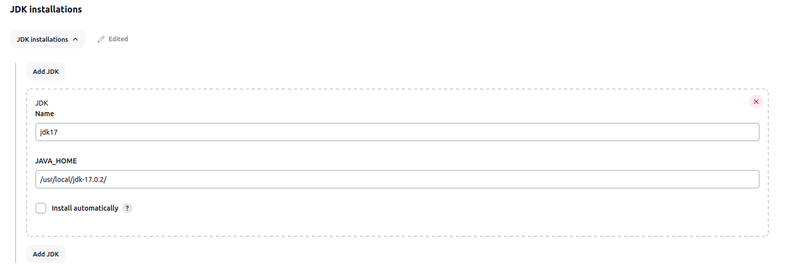
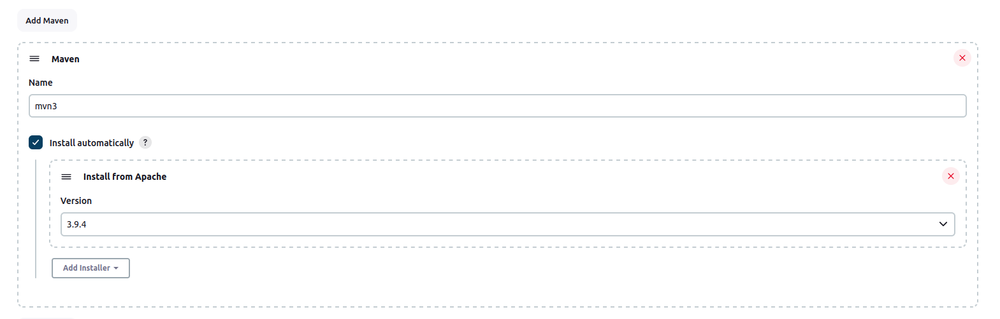
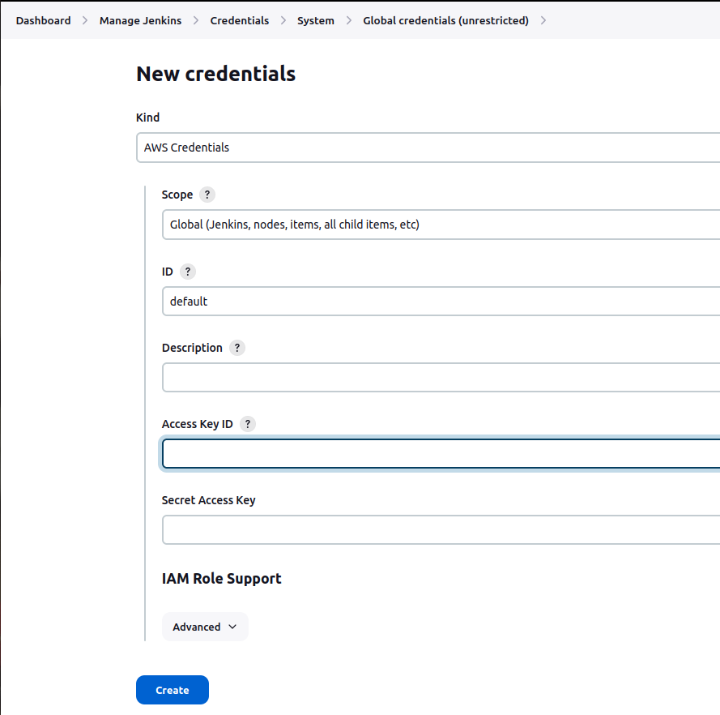
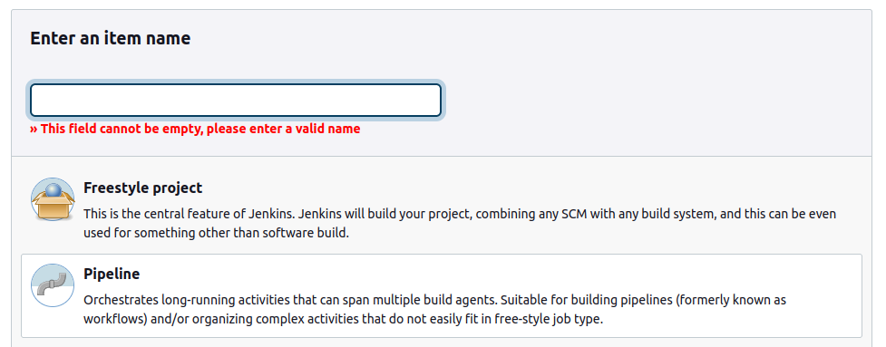
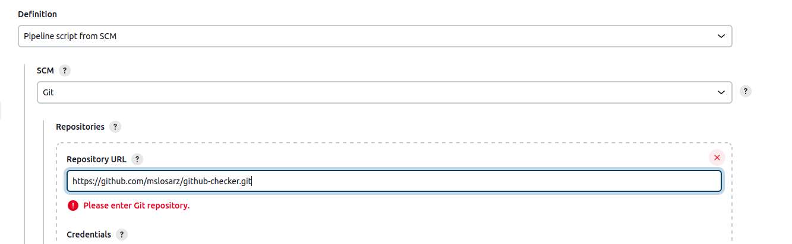

# Jenkins local
1. Execute script `./create.sh` - It'll create jenkins locally
2. Navigate to: `http://localhost:9000/`
3. Perform initial setup:
    - Navigate to: `Dashboard > Manage Jenkins > Tools`
    - Setup JDK 17 (`/usr/local/jdk-17.0.2/`): 
        
    - Setup Maven:
        
    - Setup AWS credentials
        
4. Project setup:
    - Create pipeline
    
    - Setup SCM
    
    - Repository URL: `https://github.com/mslosarz/github-checker.git`
    - Script Path: `app/Jenkinsfile`